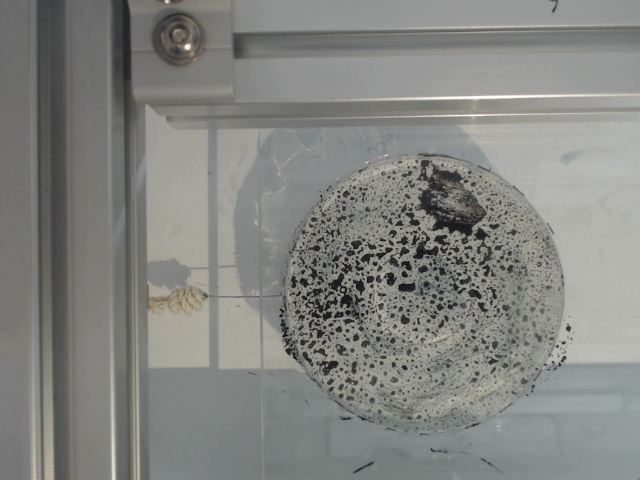
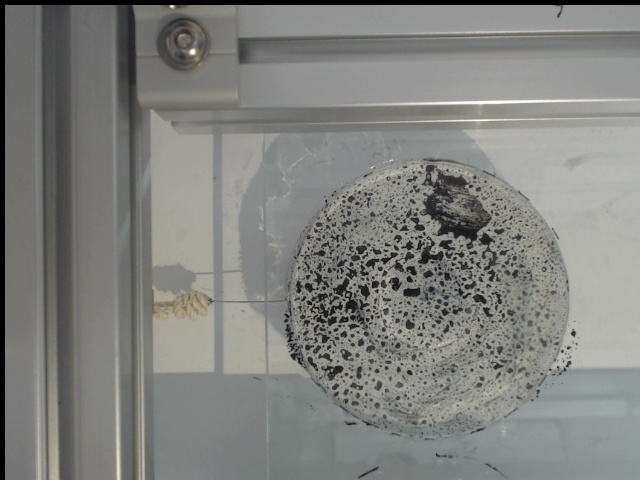

# Particle-Swarm-Optimization
Hybrid PSO: C-Core with Python Interface

Cost function: DIC ZNCC (Zero mean Normalized Cross-Correlation) correlation criteria

## Goal
Measure the target point displacement in image  
```
Target point(x,y) = (426,320)
```
## Image:
* reference image  
  

* deformed image (x:+5, y:+5) 
  

## How to run
```
python main.py
```

## Result  
```
Result from C: X=5.000, Y=5.000, Coef=0.998
```